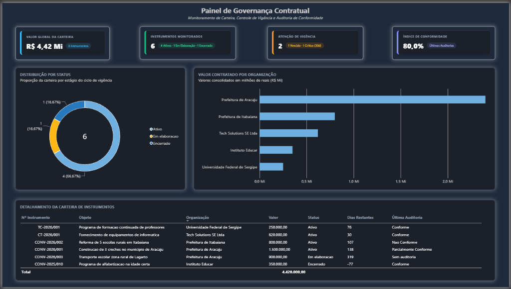
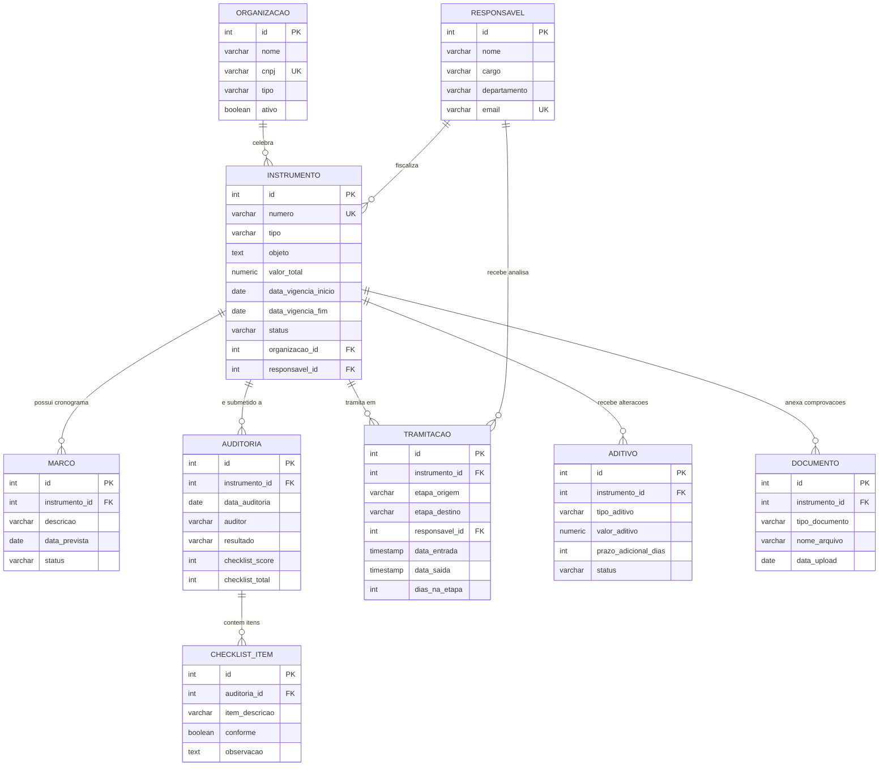
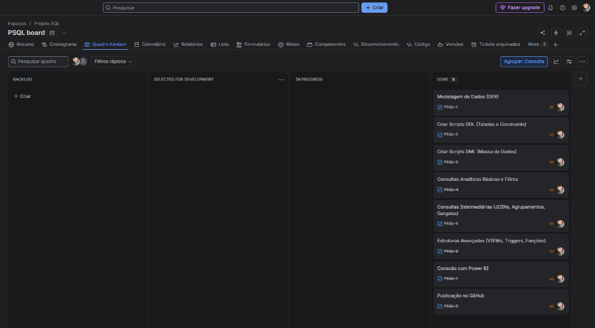

# Sistema de Governança e Controle de Instrumentos Contratuais

> **Projeto de Dados aplicado à Governança e PMO:** Modelagem relacional em **PostgreSQL**, consultas analíticas, rotinas automatizadas com Triggers, painel executivo no **Power BI** e gestão do fluxo no **Jira**.

---



> **Acesso ao Painel Interativo:** [Clique aqui para interagir com o Dashboard online no Power BI](https://app.powerbi.com/view?r=eyJrIjoiZDg1ODQxYWUtNjU3NC00MTk3LTg4MGQtOWIwOTNlYmIwNWY5IiwidCI6IjRkZDY1YWM4LTExMzItNDhmYy1hMDhkLWM3MzdmOWY0ODQ3NyJ9)

---

## Contexto de Negócio

Na gestão e auditoria de carteiras contratuais de alto volume (mais de 100 instrumentos anuais e valores superiores a R$ 5 milhões), o maior desafio estrutural é a dispersão de dados em planilhas isoladas, e-mails e processos manuais. Isso gera retrabalho, perda de prazos de vigência e lentidão em tramitações internas.

Este projeto modela e implementa um ecossistema completo de dados para solucionar esse problema:
* **Centralização relacional** de dados de contratos, convênios e termos de cooperação.
* **Rastreabilidade total** de tramitações entre setores (Jurídico, Financeiro, Gabinete, etc.).
* **Auditoria contínua de conformidade** com checklists estruturados e histórico evolutivo.
* **Automação de regras de negócio** direto no banco de dados via Triggers e Functions.
* **Painel Executivo no Power BI** com visão em tempo real para tomada de decisão pela liderança.

---

## Arquitetura do Banco de Dados (DER)

O banco de dados foi construído sobre o **PostgreSQL** com schema próprio (`governanca`), normalizado em 3ª Forma Normal (3FN), contendo **9 tabelas interconectadas**, chaves primárias, estrangeiras (`FOREIGN KEY`), regras de validação (`CHECK`) e índices de performance:



---

## Estrutura do Repositório

```text
├── 01_schema_tabelas.sql          # DDL: Criacao do schema, 9 tabelas, constraints e indices
├── 02_dados_iniciais.sql           # DML: Populacao com massa de dados realista para testes
├── 03_consultas_analiticas.sql     # Consultas analiticas de controle e monitoramento da carteira
├── 04_views_functions_triggers.sql # VIEWs, rotinas de calculo de vigencia e triggers
├── img/
│   ├── dashboard_powerbi.png       # Captura do painel executivo no Power BI
│   └── quadro_kanban_jira.png      # Fluxo de entregas no Jira Kanban
└── README.md                       # Documentacao completa do projeto
```

---

## Destaques Técnicos de SQL

### 1. Detecção de Gargalos Operacionais (`AVG` + `HAVING`)
Consulta analítica para identificar etapas com lentidão crônica no fluxo de governança:
```sql
SELECT etapa_origem, etapa_destino,
       ROUND(AVG(dias_na_etapa), 1) AS media_dias,
       COUNT(*) AS total_tramitacoes
FROM tramitacao
WHERE dias_na_etapa IS NOT NULL
GROUP BY etapa_origem, etapa_destino
HAVING AVG(dias_na_etapa) > 3
ORDER BY media_dias DESC;
```
> **Resultado:** A etapa de *Análise Documental para Parecer Jurídico* registrou média de **6.5 dias**, apontando o gargalo operacional.

### 2. Automação de Cálculo de Tempo via `TRIGGER`
Automação que calcula a quantidade de dias gastos em cada etapa automaticamente no momento do registro da data de saída:
```sql
CREATE OR REPLACE FUNCTION calcular_dias_na_etapa()
RETURNS TRIGGER AS $$
BEGIN
    IF NEW.data_saida IS NOT NULL AND OLD.data_saida IS NULL THEN
        NEW.dias_na_etapa := EXTRACT(DAY FROM (NEW.data_saida - NEW.data_entrada));
    END IF;
    RETURN NEW;
END;
$$ LANGUAGE plpgsql;

CREATE TRIGGER trg_dias_etapa
    BEFORE UPDATE ON tramitacao
    FOR EACH ROW
    EXECUTE FUNCTION calcular_dias_na_etapa();
```

### 3. VIEW Consolidada para Consumo em BI (`painel_carteira`)
Estrutura virtual criada no banco para alimentar diretamente ferramentas de Business Intelligence (Power BI), eliminando processamento redundante:
* Cálculo dinâmico de `dias_restantes` (`data_vigencia_fim - CURRENT_DATE`).
* Subconsulta correlacionada para resgatar o resultado da última auditoria realizada.
* Truncamento de escopo textual (`LEFT`) e tratamento de nulos (`COALESCE`).

### 4. Consultas Analíticas Avançadas (`RANK` e `LAG`)
* **Ranking Financeiro:** Uso de `RANK() OVER (ORDER BY SUM(valor_total) DESC)` para ordenar a concentração de recursos por organização parceira.
* **Evolução de Auditoria:** Uso de `LAG()` particionado por instrumento para medir variações de pontuação entre auditorias sucessivas.

---

## Painel Executivo no Power BI

O painel foi construído no **Power BI Desktop** consumindo nativamente o banco **PostgreSQL** em modo escuro:

* **Link de Acesso Interativo:** [Acessar Painel de Governança Contratual](https://app.powerbi.com/view?r=eyJrIjoiZDg1ODQxYWUtNjU3NC00MTk3LTg4MGQtOWIwOTNlYmIwNWY5IiwidCI6IjRkZDY1YWM4LTExMzItNDhmYy1hMDhkLWM3MzdmOWY0ODQ3NyJ9)

### Componentes do Painel:
1. **Cards de Indicadores Executivos:**
   * **Total de Instrumentos sob Gestão:** 6 instrumentos ativos ou monitorados.
   * **Valor Global da Carteira:** R$ 4,42 Milhões monitorados.
2. **Gráfico de Rosca (Status da Carteira):** Proporção entre Ativos, Em Elaboração e Encerrados.
3. **Gráfico de Barras Horizontais (Concentração por Parceiro):** Volume financeiro alocado por ente conveniado (destaque para Prefeituras e Fornecedores).
4. **Matriz Detalhada da Carteira:**
   * Número do Instrumento, Objeto e Organização conveniada.
   * Valor financeiro e Status operacional.
   * **Indicador de Dias Restantes de Vigência** (alertas para prazos expirados ou próximos do fim).
   * **Status da Última Auditoria** (Conforme, Parcialmente Conforme, Não Conforme).

---

## Gestão Ágil do Projeto no Jira

O projeto foi gerenciado através de um quadro **Kanban no Jira**, aplicando boas práticas de gestão:



| Ticket | Escopo | Status |
| :--- | :--- | :---: |
| **PSQL-1** | Modelagem de Dados (DER) | Concluído |
| **PSQL-2** | Criar Scripts DDL (Tabelas e Constraints) | Concluído |
| **PSQL-3** | Criar Scripts DML (Massa de Dados) | Concluído |
| **PSQL-4** | Consultas Analíticas Básicas e Filtros | Concluído |
| **PSQL-5** | Consultas Intermediárias (JOINs, Agrupamentos, Gargalos) | Concluído |
| **PSQL-6** | Estruturas Avançadas (VIEWs, Triggers, Funções) | Concluído |
| **PSQL-7** | Conexão com Power BI | Concluído |
| **PSQL-8** | Publicação no GitHub | Concluído |

---

## Como Replicar este Projeto

### Pré-requisitos:
* PostgreSQL 14+ instalado (com pgAdmin 4).
* Power BI Desktop (opcional, para visualização).

### Passo a Passo:
1. **Clone o repositório:**
   ```bash
   git clone https://github.com/danyellemarques/governanca-instrumentos-contratuais.git
   ```
2. **Execute os scripts no PostgreSQL na seguinte ordem:**
   ```bash
   psql -U postgres -d seu_banco -f 01_schema_tabelas.sql
   psql -U postgres -d seu_banco -f 02_dados_iniciais.sql
   psql -U postgres -d seu_banco -f 03_consultas_analiticas.sql
   psql -U postgres -d seu_banco -f 04_views_functions_triggers.sql
   ```
3. **Abra o Power BI Desktop** e conecte-se à fonte `PostgreSQL` apontando para o banco criado, selecionando a VIEW `governanca.painel_carteira`.

---

## Autora

**Danyelle Marques**  
*Analista de Projetos | Governança e PMO*  
* Aracaju/SE, Brasil  
* [LinkedIn](https://linkedin.com/in/danyelle-marques)  
* [danyelle.marquues@gmail.com](mailto:danyelle.marquues@gmail.com)
